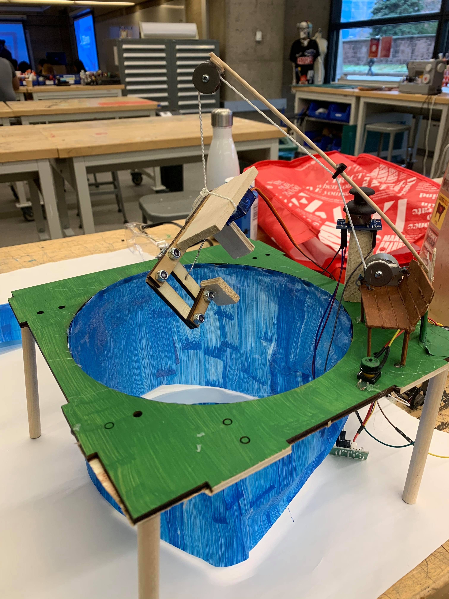
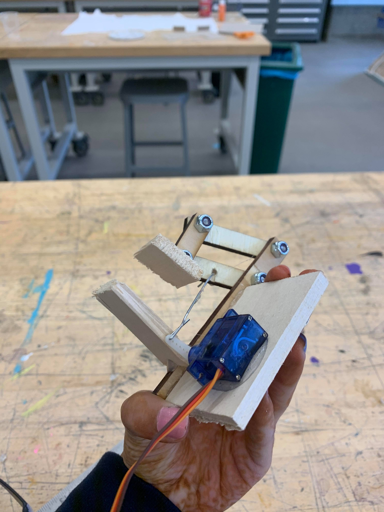

## Invisible Fishing

Invisible Fishing is an installation that utilizes the stepper and servo motors in order to recreate the recreational practice of fishing. 
The intent of this project is to induce nostalgia in everyone who has ever played a fishing game online (like that in Club Penguin) or 
has utilized stuffed-animal crane machines in arcades. However, the catch is that although it may seem like a fair game on the outset, like 
most arcade crane games seem to be, this game is also rigged in the fact that the gripper/ claw mechanism can only hold onto something large
so long as the reel is lowered. If a user wants to reel in their catch, it must be small enough so that the gripper can still hold onto it while
the fishing rod is winding up at a normal pace. If the user wants to reel in a big catch, they must either release that ambition or
deal with a slow reel up. This aesthetic of the game is directly correlated to the design and placement of the motors in the circuit.

This device retains the sensors from previous projects, namely the push button and the joystick, in order to add a dimension of control
over the motors so that they do not run indefinitely. In terms of enclosure, it features a makeshift pond with a bench, fishing rod
attached. No subject is seated on the bench, since the idea is for the user who is operating the joystick and the button to feel like they 
are on the bench by standing behind it/ near it. This gives the user the possibility to feel immersed in the scene.

This project does not rely on wireless.

## Components

This project utilized the following:

28BYJ-48 Step Motor
SG90 Tower Pro MicroServo
Push Button
Joystick
ESP32

## Usage

In order to use this product, the user can engage in two ways: the joystick and the button. The joystick is functional only on the 
y-axis, as it aims to move the claw up or down. The button designates whether the claw is open or closed. If the button is pressed,
the claw closes around the object. If the button is not pressed, the claw is open to grab things. 

## Reproducibility

The main difficulty encountered in this project that may pose a challenge to future creators was figuring out the mechanical 
designs for the two main systems: the pulley system in the fishing rod and the gripper system in the claw. In order to create
the fishing rod, I myself created two pulleys out of washers and hot glued one of the pulleys to the shaft of the stepper. In order to create
the gripper mechanism, I fashioned a claw that would have one part of it connected to the servo that could move due to its
flexible joint connection. It is quite large due to the fact that it needs to host a servo, but I believe that this adds
an element of child-like absurdity and enjoyment to the project.

Circuit-wise, it was simple to correlate the direction of the stepper motor's rotation with the inputs from the joystick and the angle
of the servo with the input from the button.

## Installation

This device is meant to be interactive. Because it relies on wired connection, it must be situated near an outlet, but due to
the fact that it can be controlled by a joystick and button, it can run for long periods of time. 

## Video

https://youtu.be/o9pdLavgYgI

